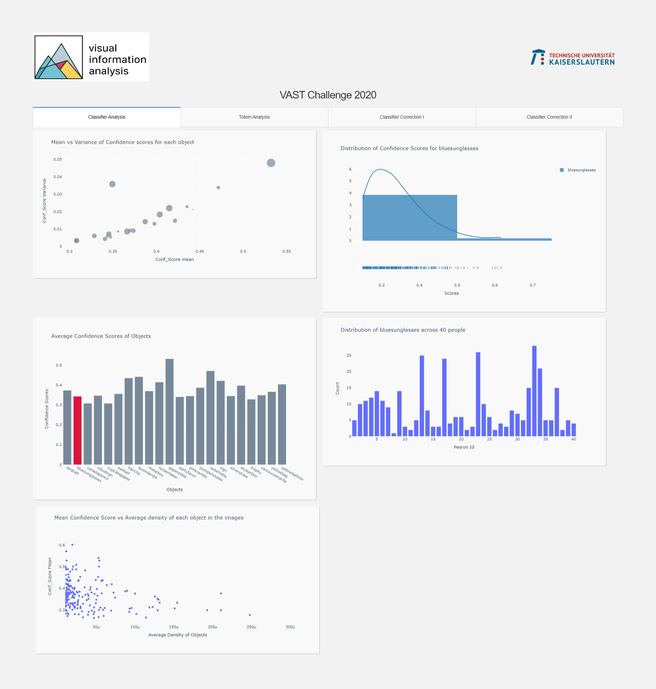

# VAST Challenge 2020.

The following is a framework for analysing the performance of a object recognition model. With access to the predictions(bounding box co-ordinates, classes, confidence scores) of the model, we try to give the user an overview of the performance of the model. Using User Feedback, we propose ways of correcting the model's performance. eg: By eliminating False Positives. 

Overview of our tool:


Steps to run the tool:

-Install libraries:
```
pip install dash==1.14.0
pip install scikit-learn
pip install numpy
pip install cv
pip install nltk
pip install Pillow-PIL
pip install networkx
pip install pandas
pip install matplotlib
```
- Download the dataset from the portal
```
https://vast-challenge.github.io/2020/MC2.html
```
and copy the downloaded folder (with name MC2) inside the directory scripts_assets_datasets.

- Modify the images to draw rectangles that corresponds to the bounding box predictions from the classifier that is used as reference during the correction process.

```
python draw_bounding_boxes.py
```
- Construct a grid of training images for each object that is used as reference during the correction process

```
python gridify_train_images.py
```
- Deploy DASH as a web application.

```
cd scripts_assets_datasets
python deploy_dash_vast2020.py
```